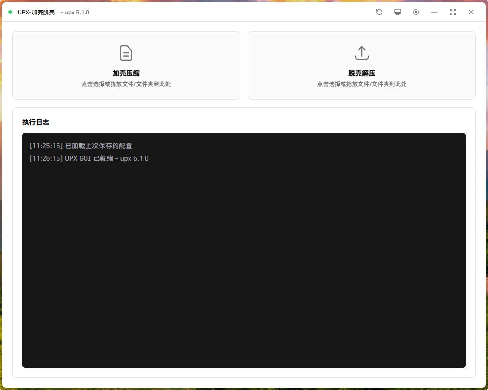
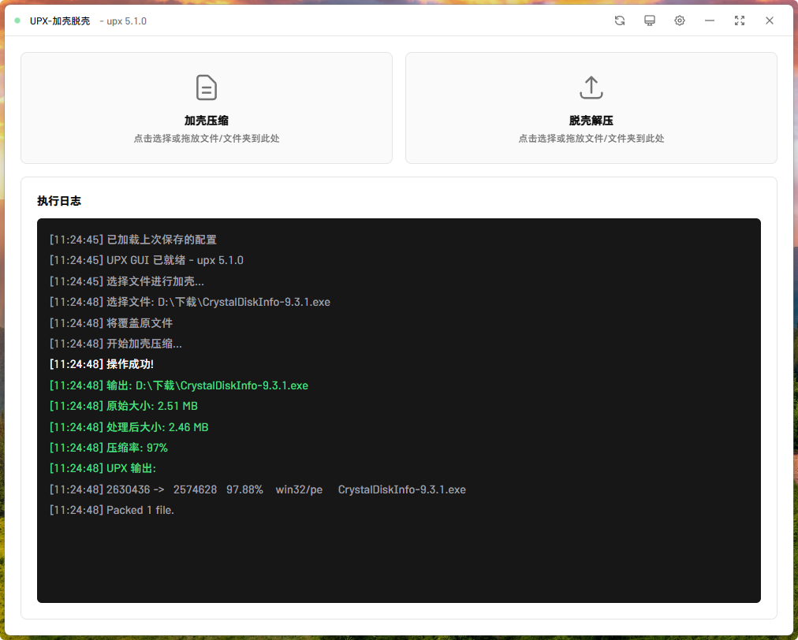
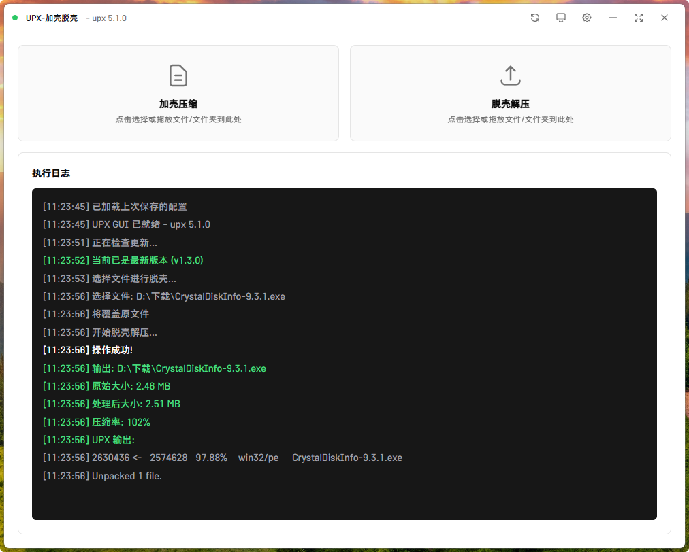
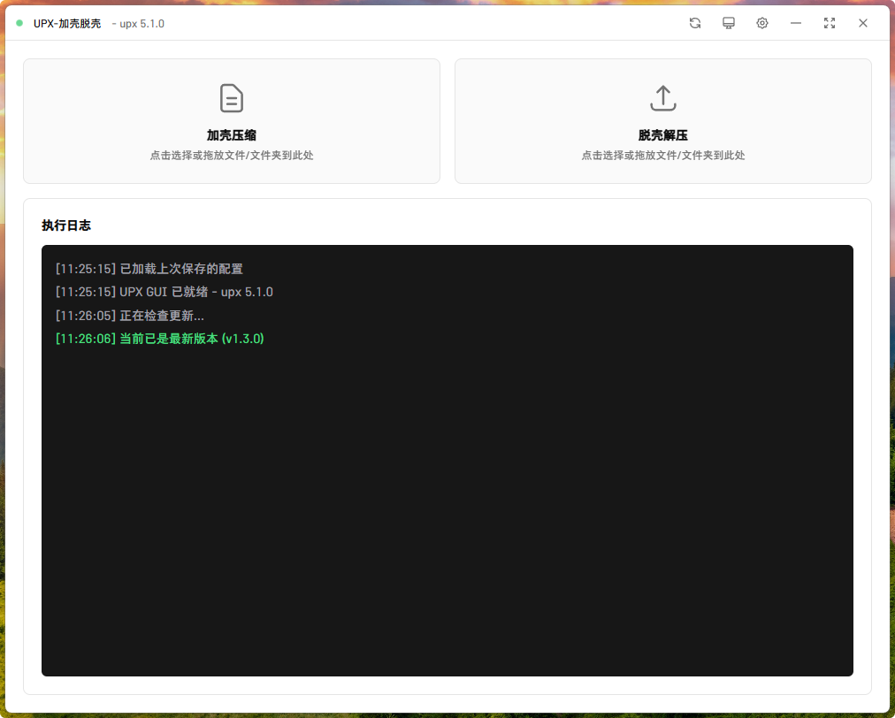
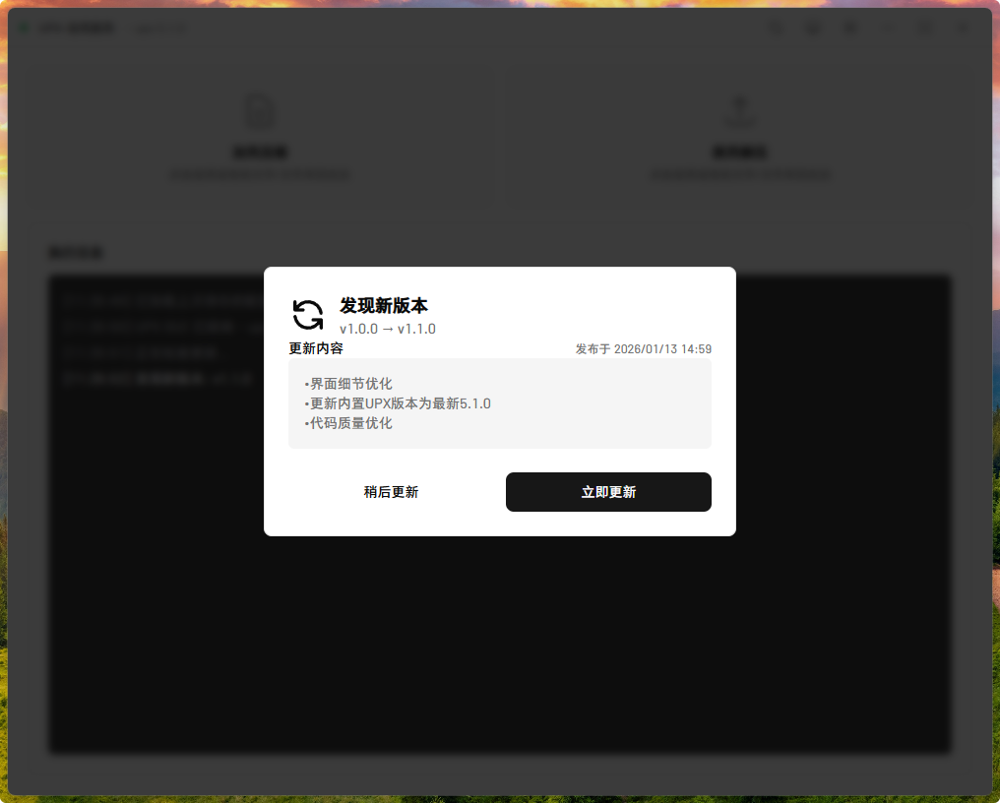

# UPX-Tools

一个基于 Tauri 开发的 UPX 压缩工具图形界面，小而美。

## 应用截图

### 主界面


### 加壳压缩


### 脱壳解压


### 设置界面


### 检查更新
| 已是最新版本 | 发现新版本 |
|:---:|:---:|
|  |  |


## 功能特性

- 界面美观：基于 shadcn/ui 设计风格，简洁直观的操作界面
- 体积轻量：应用程序体积小，启动速度快，资源占用低
- 便携版本：支持单文件便携版，无需安装即可运行
- 文件压缩：支持对 EXE 和 DLL 文件进行压缩加壳
- 文件解压：支持对已压缩的文件进行解压脱壳
- 批量处理：支持选择文件夹批量处理多个文件
- 压缩级别：提供 1-9 和 best 多个压缩级别选项
- 极限压缩：支持 ultra-brute 模式获得最高压缩率
- 强制压缩：可处理带有 GUARD_CF 保护的文件
- 文件备份：可选择在处理前自动备份原文件
- 递归处理：支持包含子文件夹的批量处理
- 图标刷新：内置 Windows 图标缓存清理功能
- 检查更新：一键检查 GitHub 最新版本
- 实时日志：显示详细的处理过程和结果信息

## 技术栈

- 前端：HTML + TailwindCSS + JavaScript（shadcn/ui 设计风格）
- 后端：Rust + Tauri 2.0
- 核心：UPX 可执行文件

## 下载安装

前往 [Releases](https://github.com/YuSanllworking/UPX-GUI/releases) 页面下载最新版本：

- **便携版**：下载 `*-portable.exe`，双击即可运行，无需安装
- **安装版**：下载 `*.msi` 或 `*-setup.exe`，运行安装程序

## 使用说明

### 基本操作

1. 启动应用程序
2. 点击左侧 "加壳压缩" 或右侧 "脱壳解压" 按钮
3. 选择要处理的文件或文件夹
4. 等待处理完成，查看执行日志

### 拖放操作

- 直接将文件或文件夹拖放到对应的按钮区域
- 拖放到加壳区域：自动开始压缩
- 拖放到脱壳区域：自动开始解压
- 支持同时拖放多个文件或文件夹

### 设置选项

点击右上角齿轮图标打开设置面板：

- 压缩级别：1-9 或 best，数字越大压缩率越高但速度越慢
- 覆盖原文件：直接替换源文件，不生成新文件
- 备份原文件：处理前自动创建 .bak 备份
- 极限压缩：使用 ultra-brute 模式，获得最高压缩率但耗时较长
- 包含子文件夹：批量处理时递归扫描所有子目录
- 强制压缩：强制处理受保护的文件，如带 GUARD_CF 的程序

**配置自动保存**：所有设置会在关闭设置面板时自动保存，下次启动应用时会自动加载上次的配置。配置文件保存在应用程序目录下的 `upx_gui_config.json` 文件中。

### 检查更新

点击右上角下载图标按钮，可检查 GitHub 仓库是否有新版本发布，如果有新版本会自动打开下载页面。

> **提示**：如果频繁检查更新遇到 API 限制，可设置环境变量 `GITHUB_TOKEN` 提高请求配额。

### 刷新图标缓存

点击右上角刷新图标按钮，可清理 Windows 图标缓存并重启资源管理器。

## 开发环境搭建

### 环境要求

- Node.js 16+
- Rust 1.70+
- Windows 10/11

### 安装依赖

```bash
# 安装前端开发依赖（ESLint + Prettier）
npm install

# 安装 Tauri CLI
cargo install tauri-cli

# 或使用 npm
npm install -g @tauri-apps/cli
```

### 代码检查与格式化

项目使用 ESLint 和 Prettier 进行代码质量控制：

```bash
# 检查代码问题
npm run lint

# 自动修复代码问题
npm run lint:fix

# 格式化代码
npm run format

# 检查代码格式
npm run format:check

# 完整检查（lint + format）
npm run check
```

**代码规范**：
- 缩进：4 空格
- 字符串：单引号
- 结尾：无分号

### 项目结构

```
UPX-Tools/
├── ui/                 # 前端代码
│   ├── index.html     # 主页面
│   ├── css/           # 样式文件
│   └── js/            # JavaScript 代码
├── src-tauri/         # Rust 后端
│   ├── src/           # Rust 源码
│   └── tauri.conf.json # Tauri 配置
├── upx/               # UPX 工具
│   └── upx.exe        # UPX 可执行文件
├── .eslintrc.json     # ESLint 配置
├── .prettierrc.json   # Prettier 配置
└── package.json       # npm 依赖配置
```

## 编译方法

### 开发模式运行

```bash
# 进入项目目录
cd UPX-Tools

# 启动开发服务器
cargo tauri dev
```

### 生成发行版本

```bash
# 完整编译（推荐，包含便携版）
npm run build

# 或仅编译安装包
cargo tauri build
```

### 编译产物

编译完成后的文件位于 `src-tauri/target/release/bundle/`：

```
bundle/
├── Portable/
│   └── UPX-Tools.exe      # 便携版（单文件，内嵌 UPX）
├── msi/
│   └── *.msi              # MSI 安装包
└── nsis/
    └── *.exe              # NSIS 安装包
```

### 版本说明

| 版本类型 | 说明 |
|---------|------|
| 便携版 | 单个 EXE 文件，内嵌 UPX，无需安装，运行时自动释放到临时目录 |
| MSI 安装包 | 传统 Windows Installer 格式，支持静默安装 |
| NSIS 安装包 | 现代化安装程序，支持自定义安装选项 |

### 注意事项

1. 首次编译需要下载依赖，时间较长
2. 确保 upx 目录下存在 upx.exe 文件
3. 便携版会将 upx.exe 内嵌到程序中，运行时自动释放
4. 安装版会将 upx.exe 打包到安装目录
5. 发行版默认开启编译器优化，体积更小速度更快

## 相关链接

UPX 官方仓库: https://github.com/upx/upx

Tauri 官方文档: https://tauri.app
