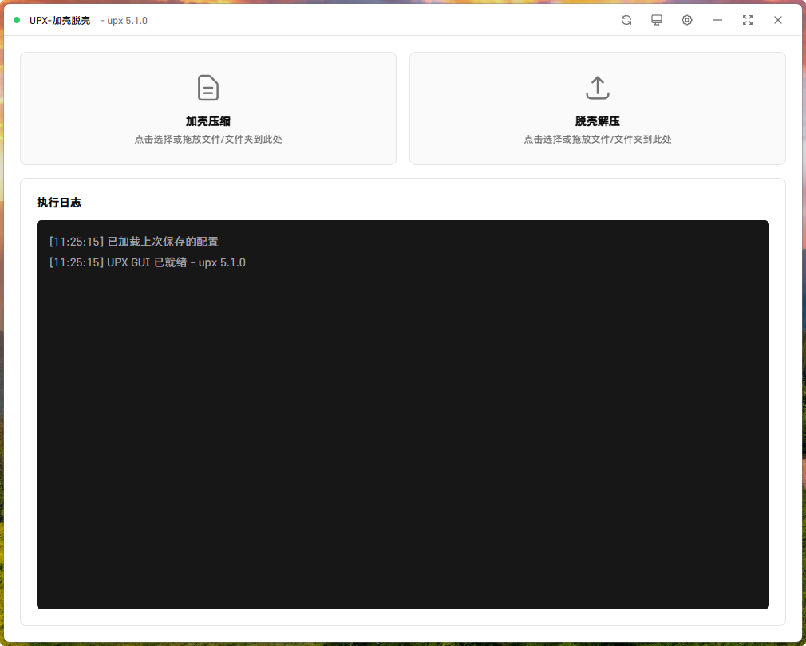
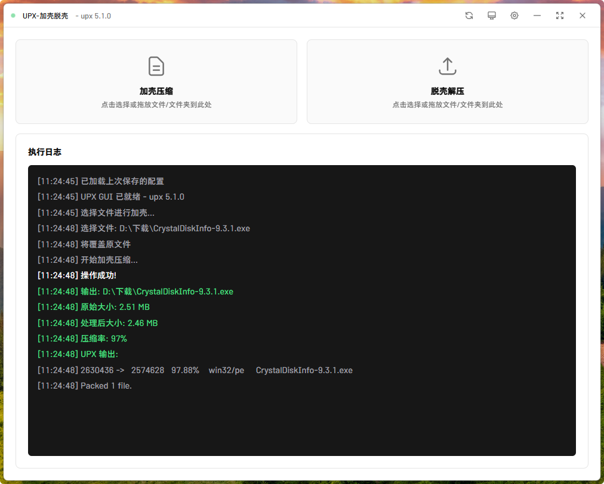
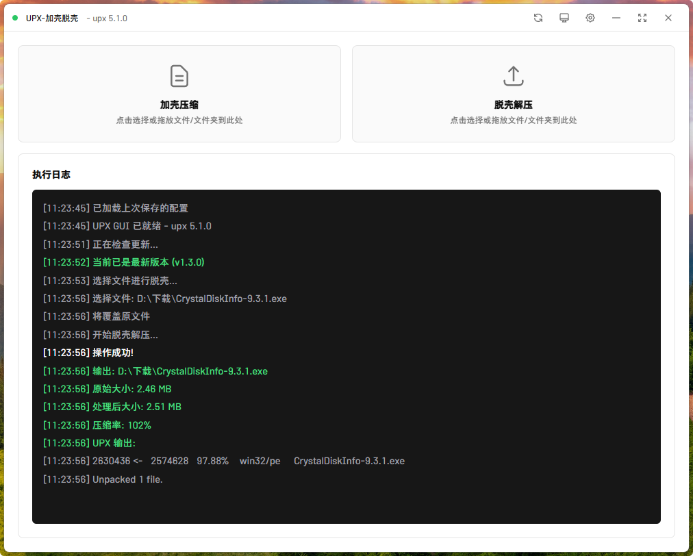
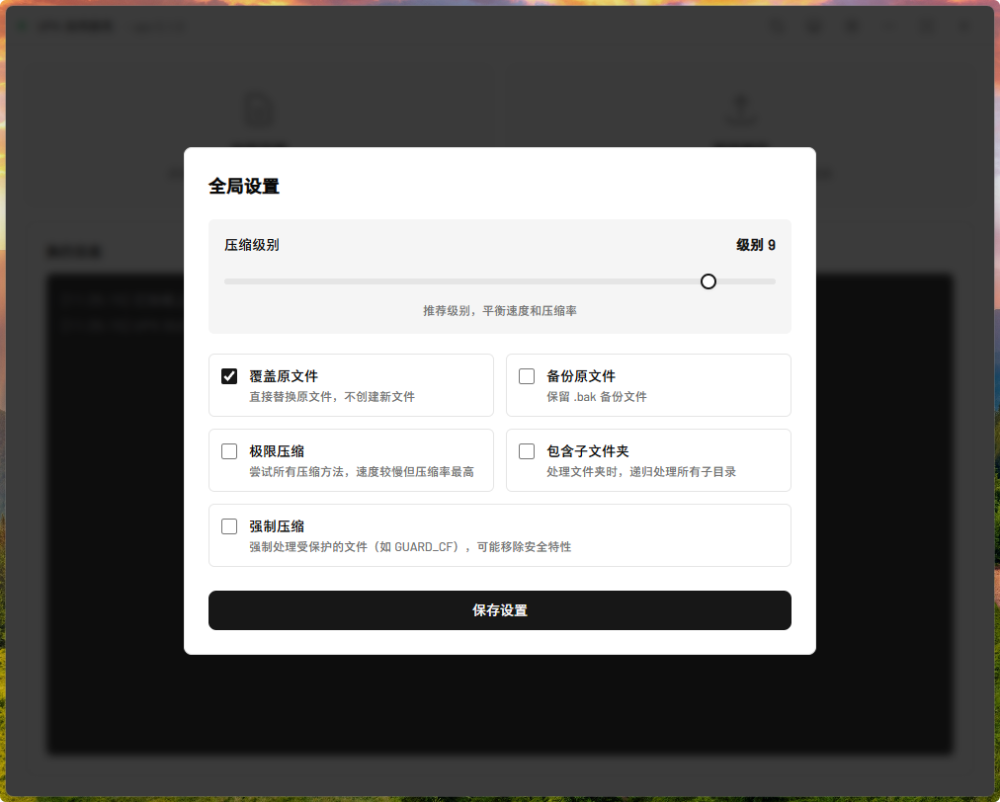
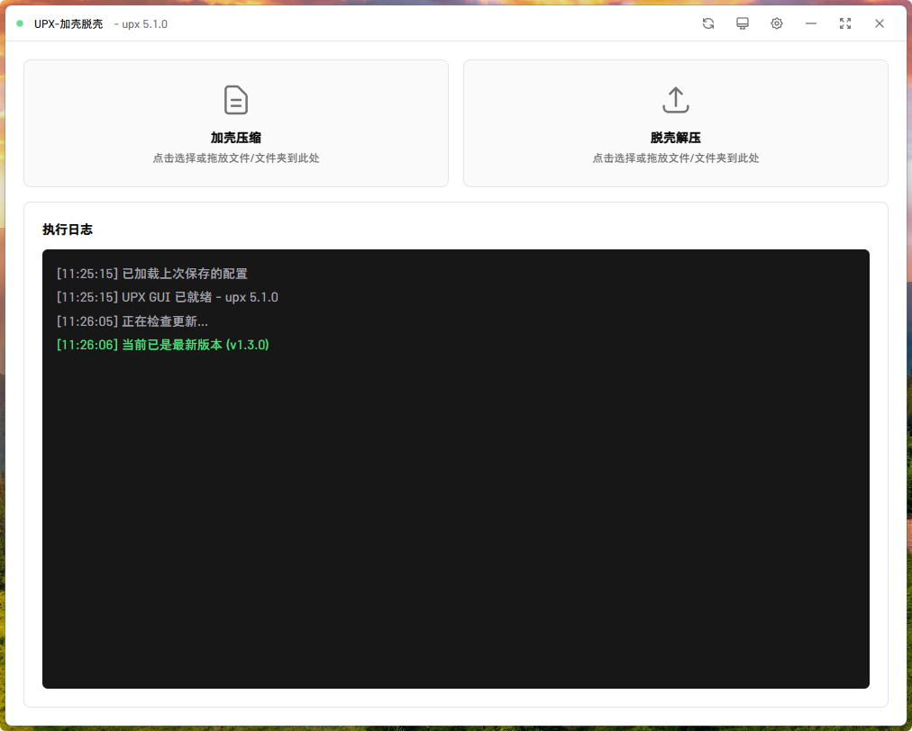
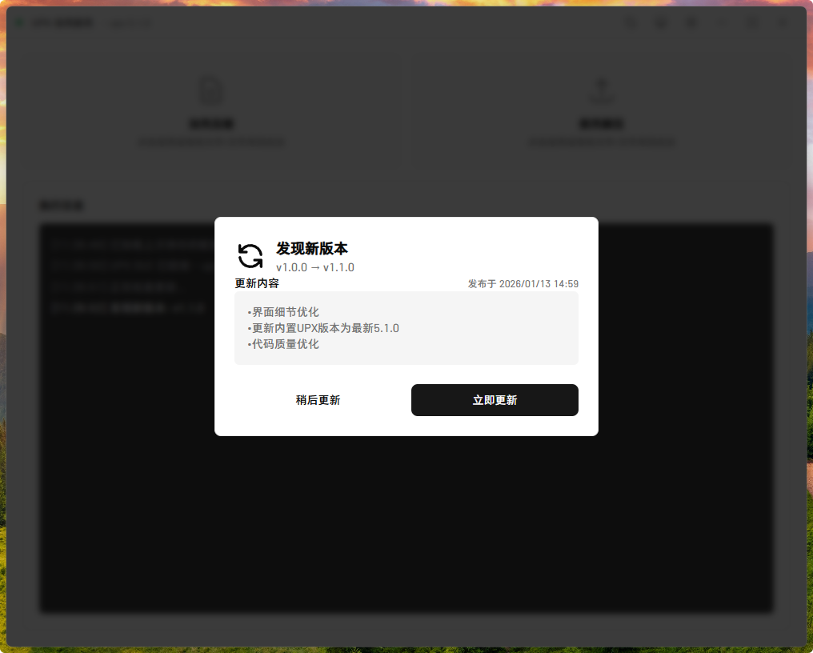

# UPX-Tools

基于 Tauri 2 的 Windows UPX 可视化加壳/脱壳工具。前端使用原生 HTML、JavaScript 和 Tailwind CSS，支持安装版与单文件便携版。

## 应用截图

### 主界面


### 加壳压缩


### 脱壳解压


### 设置界面


### 检查更新
| 已是最新版本 | 发现新版本 |
|:---:|:---:|
|  |  |


## 功能特性

- 设计风格：原生前端采用 shadcn/ui 风格的样式，不依赖 React 组件库
- 便携版本：支持单文件便携版，内嵌 UPX，无需安装应用本身
- 加壳/脱壳：选择 EXE、DLL 文件，或扫描文件夹中的 EXE、DLL
- 批量处理：按 CPU 逻辑核心数分批并发执行，支持可选的子目录扫描
- 压缩选项：1–9、best、LZMA、ultra-brute 和 `--force`
- 原文件保护：可启用处理前备份；压缩可选择覆盖或另存为
- 图标刷新：清理 Windows 图标缓存并重启资源管理器
- 检查更新：启动自动检查或手动检查，应用内选择便携版或安装版下载
- 执行日志：显示单文件处理结果和错误提示，限制日志数量以避免持续累积

## 技术栈

- 前端：HTML + TailwindCSS + JavaScript（shadcn/ui 设计风格）
- 后端：Rust + Tauri 2.0
- 核心：UPX 可执行文件

## 下载安装

前往 [Releases](https://github.com/Y-ASLant/UPX-Tools/releases) 页面下载最新版本：

- **便携版**：下载 `*-portable.exe`，双击即可运行，无需安装
- **安装版**：下载 `*.msi` 或 `*-setup.exe`，运行安装程序

## 使用说明

### 基本操作

1. 启动应用程序
2. 点击左侧 "加壳压缩" 或右侧 "脱壳解压" 按钮
3. 在文件对话框中选择一个或多个 EXE/DLL；文件夹请通过拖放添加
4. 等待处理完成，查看逐文件日志；当前批量汇总可能把失败或取消操作计为成功，不应仅依赖汇总数量

### 拖放操作

- 直接将文件或文件夹拖放到对应的按钮区域
- 拖放到加壳区域：自动开始压缩
- 拖放到脱壳区域：自动开始解压
- 支持同时拖放多个文件或文件夹
- 拖放到按钮以外的窗口区域：暂存文件，再点击所需操作按钮开始处理
- 文件夹仅扫描 EXE/DLL，默认不包含子目录；需要递归时先启用「包含子文件夹」
- 拖放路径没有去重，避免同时拖入文件夹和其中的同一文件；运行中重复操作也可能启动独立批次

### 设置选项

点击右上角齿轮图标打开设置面板：

| 选项 | 默认值 | 行为 |
| --- | --- | --- |
| 压缩级别 | 9 | 1–9 或 best；选择 best 时使用 `--best` |
| 覆盖原文件 | 开启 | **仅控制压缩**；关闭后选择输出路径，默认文件名为 `原文件名_packed.exe`（DLL 保留 `.dll`） |
| 备份原文件 | 关闭 | 压缩和脱壳前复制为完整文件名追加 `.bak`，如 `app.exe.bak`；已有同名备份会被覆盖 |
| LZMA | 关闭 | 压缩时追加 `--lzma` |
| 极限压缩 | 关闭 | 使用 `--ultra-brute`，优先于所选压缩级别；可能耗时较长 |
| 包含子文件夹 | 关闭 | 扫描文件夹时递归查找 EXE、DLL |
| 强制压缩 | 关闭 | 追加 `--force`（脱壳也会传入）；不保证所有受保护文件都能处理 |
| 启动时检查更新 | 开启 | 启动加载配置后延迟约 1 秒检查最新版本 |

**脱壳始终覆盖原文件**，不受「覆盖原文件」选项影响。未开启覆盖的批量压缩会为每个文件请求输出路径，而不是统一输出到一个目录。建议处理重要文件前启用备份或另行保存副本。

点击「保存设置」或设置弹窗遮罩时保存配置并关闭面板，下次启动加载。单独修改选项或关闭应用窗口不会写入配置。配置文件位于**应用可执行文件所在目录**的 `upx_gui_config.json`，不是用户的 AppData 目录；该目录必须可写，否则无法持久化设置。当前保存失败只记录到控制台，「设置已保存」提示不能保证写入成功。

### 检查更新

点击右上角下载图标，查询 `Y-ASLant/UPX-Tools` 的最新 GitHub Release。发现更新后显示应用内弹窗，包含版本信息、更新说明和便携版/安装版下载按钮，**不会自动打开下载网页**。MSI 可从 Releases 页面手动下载。

选择下载项后，文件保存到系统临时目录 `upx-tools-update/`，随后启动下载的 EXE：安装版启动安装程序，便携版启动新程序。当前应用不会自动退出，旧便携版也不会被自动替换；便携版用户需自行替换原文件。

弹窗进度条是模拟进度，不代表实际下载百分比。当前下载流程没有校验发布资产的哈希或签名；仅从可信的官方发布源获取程序。

> **提示**：可设置环境变量 `GITHUB_TOKEN` 提高检查更新的 GitHub API 配额；需让启动的应用进程继承该变量。它仅用于更新检查请求，不用于发布资产下载。

### 刷新图标缓存

点击右上角刷新图标按钮会立即尝试清理图标缓存并重启资源管理器，没有确认对话框。任务栏和桌面可能短暂消失；后端会忽略部分系统命令错误，因此界面提示完成并不保证所有缓存都已清理。

## 开发环境搭建

### 环境要求

- Windows 10/11；现有构建与发布工作流面向 Windows x64
- Node.js：推荐使用仍受支持的 LTS 版本；ESLint 9 要求 `^18.18.0 || ^20.9.0 || >=21.1.0`，不支持原文档中的 Node.js 16
- Rust stable，使用 MSVC 工具链；项目未声明固定的最低 Rust 版本
- Microsoft C++ Build Tools，安装「使用 C++ 的桌面开发」工作负载
- Microsoft Edge WebView2 Runtime（应用和便携版均需要）
- Tauri CLI 2；下列构建命令使用 Cargo CLI，npm 全局安装的 CLI 不能替代 `cargo tauri`
- PowerShell：`npm run post-build` 使用它复制便携版
- 可选：[just](https://github.com/casey/just)，用于执行 `.justfile` 中的快捷命令

Windows 依赖安装细节见 [Tauri 官方环境要求](https://v2.tauri.app/start/prerequisites/)。

### 安装依赖

在项目根目录执行：

```bash
# 安装前端检查、格式化和 CSS 构建依赖
npm ci

# 与 GitHub Actions 一致，安装 Tauri CLI 2
cargo install tauri-cli --version "=2.12.1" --locked
```

`package-lock.json` 和 `src-tauri/Cargo.lock` 随仓库提交。修改依赖或应用版本后同步更新锁文件；CI 使用 `npm ci` 和 Cargo `--locked`，不在构建中自动更新依赖。

确保 `upx/upx.exe` 存在：Rust 的 `include_bytes!` 在编译时读取它，安装包也将它作为资源打包。当前仓库内的 UPX 可执行文件版本为 **5.2.1**，可运行 `upx/upx.exe --version` 核对。

### 开发与 CSS 构建

```bash
# 先生成 Tailwind 样式，再启动 Tauri 开发模式
npm run build:css
cargo tauri dev

# 修改 HTML/JS 中的 Tailwind 类时，在另一个终端监听
npm run watch:css
```

前端直接从 `ui/` 加载，没有单独的前端开发服务器。`tauri.conf.json` 的 `beforeDevCommand` 和 `beforeBuildCommand` 均为空，因此直接执行 `cargo tauri dev`、`cargo tauri build` 或 `npm run build` **不会自动编译 CSS**。

安装 just 后，常用操作统一为以下 6 个入口；`just` 或 `just --list` 显示菜单：

| 命令 | 作用 |
| --- | --- |
| `just dev` | 构建一次 CSS，再启动 Tauri 开发模式 |
| `just build` | 构建 CSS、MSI/NSIS 安装包并复制便携版 |
| `just css` / `just css watch` | 构建 CSS / 在另一个终端监听 CSS |
| `just fmt` | 格式化前端和 Rust |
| `just check` | 只读检查前端 lint/格式、Rust 格式/clippy |
| `just clean` | 清理 Rust 构建产物 |

单独运行 ESLint 自动修复等细项时，使用下面的 npm/Cargo 命令，不再提供重复的 just 入口。

just 默认不回显执行命令，并为子进程设置 `npm_config_loglevel=warn`，隐藏 npm 的 `notice run`；便携版复制不打印 PowerShell 目录对象。工具自身的进度、产物路径、警告和错误仍会显示。

### 代码检查与格式化

```bash
npm run lint          # ESLint，任何 warning 都使检查失败
npm run lint:fix      # ESLint 自动修复
npm run format        # 格式化 ui/ 中的 JS、HTML、CSS
npm run format:check  # 检查前端格式
npm run check         # 前端 lint + 格式检查，不包含 Rust

cargo fmt --manifest-path src-tauri/Cargo.toml
cargo clippy --manifest-path src-tauri/Cargo.toml
cargo test --manifest-path src-tauri/Cargo.toml
```

`just check` 依次执行 `npm run check`、Rust 格式检查和 Rust clippy，不包含测试；任一步失败立即停止，不修改文件。与 CI 一致的 Rust 严格检查为：

```bash
cargo fmt --manifest-path src-tauri/Cargo.toml --all -- --check
cargo clippy --manifest-path src-tauri/Cargo.toml --all-targets --all-features -- -D warnings
```

前端规范：4 空格缩进、单引号优先、不使用行尾分号。修改前端代码后运行 `npm run format`；修改 Rust 后运行 `cargo fmt`。

生成的 `ui/css/tailwind.css` 不参与 Prettier 检查；通过 `npm run build:css` 更新，避免格式化与压缩构建反复改写同一文件。

### 项目结构

```text
UPX-Tools/
├── ui/
│   ├── index.html              # 主窗口、设置和更新弹窗
│   ├── js/main.js              # 拖放、批处理、配置、日志、更新交互
│   ├── css/main.css            # Tailwind 入口
│   ├── css/tailwind.css        # build:css 生成的样式
│   ├── css/style.css           # 自定义样式
│   └── font/                  # 本地字体
├── src-tauri/
│   ├── src/main.rs             # UPX 执行、扫描、配置和更新命令
│   ├── Cargo.toml              # Rust 依赖和应用版本
│   └── tauri.conf.json         # 窗口、权限、资源和安装包配置
├── upx/upx.exe                 # 运行资源及编译时嵌入的 UPX
├── icons/                      # 应用与安装程序图标
├── img/                        # 文档截图
├── .github/workflows/          # Rust 检查、安装包构建、版本发布
├── .justfile                   # 可选命令快捷入口
├── tailwind.config.js          # Tailwind 扫描范围与主题
├── eslint.config.js            # ESLint 9 配置
├── .prettierrc.json            # Prettier 配置
└── package.json                # npm 依赖、检查与构建脚本
```

## 编译与发布

### 生成发行版本

```bash
# 先更新 CSS，再生成安装包并复制便携版
npm run build:css
npm run build

# 只生成安装包及 release 主程序，不执行 Portable 目录复制
cargo tauri build -- --locked
```

`npm run build` 等价于 `cargo tauri build -- --locked && npm run post-build`，不会自动编译 CSS；使用 `just build` 则会先构建 CSS，再调用 `npm run build`。便携版复制失败时会中止，不把复制错误当作成功。

### 本地编译产物

```text
src-tauri/target/release/
├── UPX-Tools.exe               # 主程序，包含嵌入的 UPX
└── bundle/
    ├── Portable/
    │   └── UPX-Tools.exe       # post-build 复制的便携版
    ├── msi/
    │   └── *.msi              # MSI 安装包
    └── nsis/
        └── *.exe              # NSIS 安装包
```

Portable 并非 Tauri 的第三种打包目标，而是同一个 release 主程序的副本；便携版不需要单独编译，但仍依赖系统 WebView2 Runtime。

UPX 查找顺序：

1. 可执行文件目录下的 `_up_/upx/upx.exe`（安装包资源）
2. 当前工作目录下的 `../upx/upx.exe`（开发路径）
3. 将嵌入的 UPX 写入系统临时目录 `upx-gui-portable/upx.exe`

Release profile 使用 `strip`、`opt-level = "z"`、LTO、单个 codegen unit 和 `panic = "abort"` 优化体积。

### 版本与 GitHub Actions

发布前同步修改 **三个**版本字段：`package.json`、`src-tauri/Cargo.toml`、`src-tauri/tauri.conf.json`，并同步更新两个锁文件。更新检查的当前版本来自 Cargo 包版本。

先提交包含版本和锁文件更新的改动，再在该提交上创建 tag。工作流读取的是 tag 指向的提交，而不是本地当前文件；重跑失败任务不会自动改用新提交。版本不匹配的旧 tag 若尚未发布 Release，可在确认影响后重建；不要覆盖已经发布的 tag。

GitHub Actions 已统一到 `.github/workflows/ci.yml`：

- `main`/`master` 分支推送及面向这两个分支的 PR：检查并构建 Windows x64 包，不再依赖提交消息中的特殊关键字。
- `v*` tag：执行同样的检查和构建；tag 必须与应用版本精确一致，检查或构建失败时不会发布。
- 构建 job 使用 Node.js 22、Rust stable 和固定版本的 Tauri CLI 2.12.1；缓存 npm、Rust 和 CLI。
- 顺序为版本校验、前端 lint/格式检查、Rust 格式/严格 clippy/测试、CSS 构建、安装包和便携版构建。
- 三种产物必须存在且非空，否则失败；成功后统一上传 `UPX-Tools-Windows-x64` artifact。tag 的发布 job 下载该 artifact，不重新构建。

tag 发布以下文件；版本含 `-` 的预发布版本标记为 prerelease：

| 文件 | 类型 |
| --- | --- |
| `UPX-Tools-{version}-x64-portable.exe` | 单文件便携版 |
| `UPX-Tools-{version}-x64.msi` | MSI 安装包 |
| `UPX-Tools-{version}-x64-setup.exe` | NSIS 安装包（当前用户安装） |

普通分支/PR 的过时运行会自动取消，tag 运行不会被新运行主动取消。默认权限为 `contents: read`，仅 tag 发布 job 获取 `contents: write`。

## 相关链接

UPX 官方仓库: https://github.com/upx/upx

Tauri 官方文档: https://tauri.app
